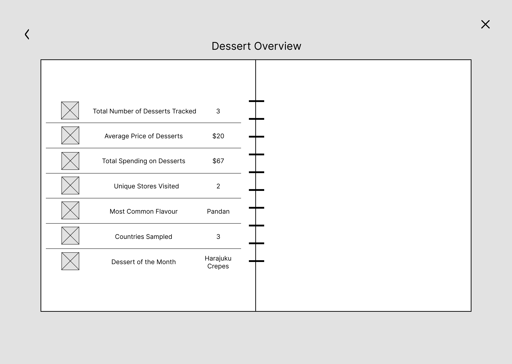

# lduo2510-tracker
 DECO2017 - Assessment 3 

# 1. Overview:
This dessert-tracking application is designed to provide users with a platform to record their indulgences. It comprises of four main sections:

1. **Home Page:** The landing page introduces the application, and provides a brief overview of its functionality

2.	**Add Desserts:** Users can add new dessert entries, providing details like the name, store, date of purchase, etc.

3.	**My Desserts:** This page displays a list of all logged dessert entries in a stylised 'dessert menu' format. Users can add more to the list, or remove entries!

4.  **Overview:** The overview dashboard presents users with a summarised view of their dessert consumption, with insights such as total desserts tracked, average spending, etc.

# 2. Configuration & Deployment 
### Prerequisites
Before configuring and deploying the application, ensure you have the following installed on your machine:

* Git: [Download Git](https://git-scm.com/downloads)
* Node.js (LTS version recommended): [Download Node.js](https://nodejs.org/en)

### 1. Clone the Repository
There are two ways to download the repository from [GitHub](https://github.com/): 
1. Downloading as a ZIP file: Navigate to `https://github.com/li1yd/lduo2510-tracker`. Click on the "Code" button, then "Download Zip"
2. Cloning with GIT: Using Git, log the following command into the terminal to clone the repository `git clone https://github.com/li1yd/lduo2510-tracker.git`

### 2. Install Dependencies 
After cloning or extracting the repository, open the terminal in the project directory and run: `npm install`, then press Enter. This command will install all the required packages to run the web app.

### 3. Start the Server 
To start the server, follow these steps:
1. In the terminal type `npm run dev` and press Enter. This command initiates the web server 
2. Once the process is finished, there wil be a message displaying `Server running at http://localhost:1234`
3. To open the application on Windows, use Cltr + Click. Otherwise, on Mac, Cmd + Click on the URL

## How to Use the Application
1. Add a Dessert: Click the "+" button to add a new dessert entry!
1. Fill in Details: Provide information about the dessert, such as name, price, store, etc.
1. Save Entry: Submit the form to log the dessert.
1. View Your Desserts: Go to the "My Desserts" section to see your logged entries.
1. Remove an Entry: Click the "Remove" button next to any dessert to delete it.
1. Explore the Overview: Visit the "Overview" section for a summary of your dessert consumption.

## Testing
The application features a single form for adding new desserts. For testing, I've provided sample information to fill out the input fields. You can find images for each dessert in this directory: public/src/images/${sampleName}.png

### Sample Entry 
|                             | Dessert 1                     | Dessert 2                       | Dessert 3                      |
|-----------------------------|-------------------------------|---------------------------------|--------------------------------|
| Dessert Name                | Vanilla Cupcake               | Old Gold Chocolate              | Mocha Coffee                   |
| Price                       | 5.50                          | 7.50                            | 5.00                           |
| Dessert Image               | public/src/images/cupcake.png | public/src/images/chocolate.png | public/src/images/coffee.png   |
| Recommended Accompaniments  | Latte, Iced Americano         | Coffee                          | Two Sugars                     |
| Date Purchased              | 2024-06-08                    | 2024-05-28                      | 2024-05-28                     |
| Dessert Type                | Baked Dessert                 | Confections                     | Dessert Drink                  |
| Flavour                     | Vanilla                       | Dark Chocolate                  | Mocha                          |
| Acquisition Method          | Store-Bought                  | Store-Bought                    | Store-Bought                   |
| Store Name                  | The Cupcake Factory           | Woolworths                      | USYD Business Building Canteen |
| Country of Origin           | United States of America      | Australia                       | Yemen                          |
| Rating                      | 4                             | 4                               | 5                              |

# 3. Development Process
To ensure that the prototype would have a consistent aesthetic, all pixel assets were deisgned by myself (~20 hours). 

Each section of the app is crafted to display information uniquely, adding a creative flair to the user experience:

1. The "Add Desserts" form guides users through multiple 'pages' to input details about their desserts - complete with visual graphics at each step to make the data entry process more engaging and intuitive. 

2. The "My Desserts" section dynamically generates a list of logged desserts, complete with expandable accordions for easy viewing and management. 

3. Furthermore, the "Overview Desserts" page presents aggregated data and a carousel of visual elements, providing insightful summaries of the users' dessert tracking.

Throughout  the devleopment process, I encountered numerous challenges, particularly in ensuring the seamless integration of features. Despite these hurdles, I felt that I had successfully implemented the design specifications, though there remains room for further improvement. The use of various libraries, such as Bootstrap and Glide.js, also played a crucial role in creating a responsive and user-friendly interface. 

## Challenges
### 1. Fetching from the API
When trying to implement the countries API, I continually ran into a "connection timed out" error when trying to fetch data from the REST Countries API (https://restcountries.com/v3.1/all). 

I think that this suggests a problem either with the API server itself or with my network connection. I've attempted to troubleshoot the issue by implementing error handling, timeouts, and retry mechanisms within my code, but the error persists. To further inspect, I've tried to access the API directly in my browser, but it also fails to load, which leads me to believe that the problem likely lies with the API server and not my specific implementation - as it is sometimes able to fetch the data. (The code is commented out in the adddesserts.js for reference)

For the solution, I’ve chosen to directly incorporate a static list of countries in a dropdown menu. This will ensure that the form will still function even if the API is unavailable. 

### 2. Deleting Entries
For a while, there was a data deletion mismatch. For instance, after deleting entries, the page would remain blank until it was refreshed, and sometimes a previously deleted entry would reappear. The issue arose  because the underlying data array wasn't being updated correctly, causing the deleted entries to persist and redisplay.

To solve this issue, I made sure to correctly remove the corresponding item from the data array using the `.splice()` method. Additionally, I also implemented logic to immediately update the displayed content on the page after a deletion - this involved dynamically displaying the "No data entries available" message if the list became empty.

### 3. Accordion Styling
My initial CSS for creating a horizontal accordion layout using `display:flex` on the `#dessertAcordion` container conflictd with Bootstrap's built-in accordion functionality. This caused all accordions to open simultaenously with one was clicked, and the vertical collapsing behaviour was broken. 

For the solution I identified and removed the conflciting `display:flex` on the container, and insteqd applied it to the individual `.accordion-item` elements using `display:flex` with `flex-direction: column. 

## Iterations & Improvements 
### 1. My Desserts Page 
For how my desserts would be displayed, I initially wanted to have a 'card' - and have it expand when clicked on. However I found that using Bootstraps Accordions was the most efficient manner of executing this in the allocated timeframe, while still having a functional layout.

I also adjusted the layout from two columns to two rows. This change optimizes screen space as more entries are added and better accommodates the expansion of accordion elements.

### 2. Desserts Overview Page 
Initially, I wanted to display the aggregated data statically, however I wanted to add more interactivity to my application, so I opted to include an interactive carousel of aggregated data to make it more engaging!

# 4. Future Scope
While I have offered my best efforts to implementing all aspects of my initial design proposal, I recognise that there are still areas for improvement that could enhance the user experience:

### Overall Refinement 
1. Accessibility: I want to ensure that the application is accessible to all users, including those with disabilities by implementing featues such as keyboard navigation, and screen reader compatability.

2. Data Validation: I want to enhance the validation processes to ensure that all user inputs are accurate, complete and secure, reducing the likelihood of errors, and improving data integrity. 

3. Addressing Unidentified Bugs: I want to further test and debug the application to identify and resolve any hidden issues that could affect the user experience, or functionality.

### Specific Features
For further implementation, I want to:
* Implement user authentication for personalised tracking 
* Add more detailed visualsition options to their overview dashboard 
* Implement a search/filter feature for easier navigation of dessert entries 